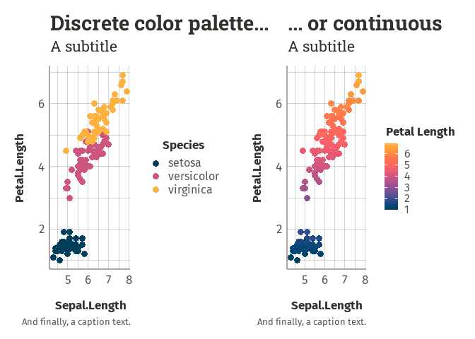
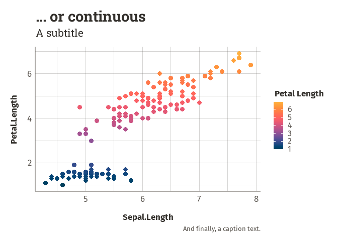
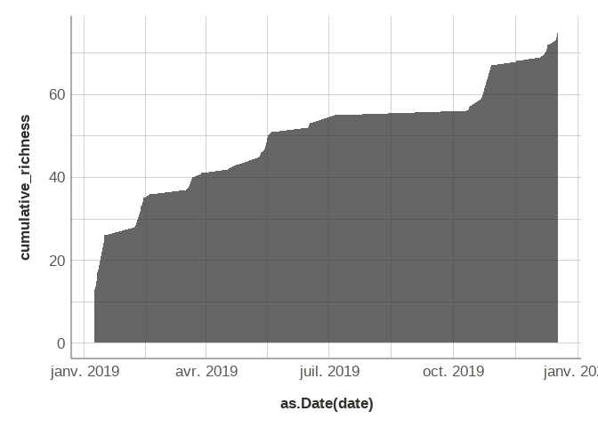

<!-- README.md is generated from README.Rmd. Please edit that file -->

# WaxTools

## Overview

`waxtools` is a package that brings together a set of useful day-to-day
functions to facilitate work in the field of (mainly) ecology. It offers
functions to clean up your datasets, customize your `ggplot2` graphs,
check and correct the geometry of sf objects, create nice commented
titles to separate scripts, and perform other specific tasks such as
calculating cumulative specific richness, reformatting dates into a
French format, etc. Thanks to the variety of its functions, `waxtools`
can be used efficiently and conveniently in a variety of contexts and
projects.

## Installation

``` r
devtools::install_github("waxtiz/waxtools")
```

## Usage

### The comment formatting function

Very simple function, but so useful in everyday life. Use it to segment
your script with titles and subtitles, like h1, h2, h3… in html. Write
your com() in the console, and the title will be put in your clipboard.

``` r
com("Project illustrating extremely well-organized code", heading = 1) # This is a H1
################################################################################
###                                                                          ###
###            Project illustrating extremely well-organized code            ###
###                                                                          ###
################################################################################


com("This section contains the loading of dependencies and datasets.", 2) # This is a H2
################################################################################
###     This section contains the loading of dependencies and datasets.      ###
################################################################################


com("Let's get to work!", 2) # H2 again
################################################################################
###                            Let's get to work!                            ###
################################################################################


com("First, let's clean up the dataset") # H3 (defaut value)
###################### First, let's clean up the dataset #######################


com("And let's visualize it:", 4) # H4 (etc.)
                         #  And let's visualize it:  #
```

### WaxTheme

``` r
library(ggplot2)
library(waxtools)

ggplot(iris, aes(Sepal.Length, Petal.Length, color = Species)) +
  geom_point(size = 3) +
  labs(title = "Discrete color palette...",
       subtitle = "A subtitle",
       caption = "And finally, a caption text.") +
  theme_wax(theme = "wax") +
  scale_color_wax_d() # or scale_color_wax(discrete = T)
```

<!-- -->

``` r
ggplot(iris, aes(Sepal.Length, Petal.Length, color = ..y..)) +
  geom_point(size = 3) +
  labs(title = "... or continuous",
       subtitle = "A subtitle",
       caption = "And finally, a caption text.") +
  theme_wax(theme = "wax") +
  scale_color_wax_c(name = "Petal Length") # or scale_color_wax(discrete = F)
```

<!-- -->

### Calculate the cumulative taxonomic richness

``` r
library(ggplot2)
library(waxtools)

result <- naturalist_df %>%
        calc_rich_sp("name", "date")

ggplot(result, aes(as.Date(date), cumulative_richness)) +
  geom_area(alpha = .75) +
  theme_wax()
```

<!-- -->

### And more…
