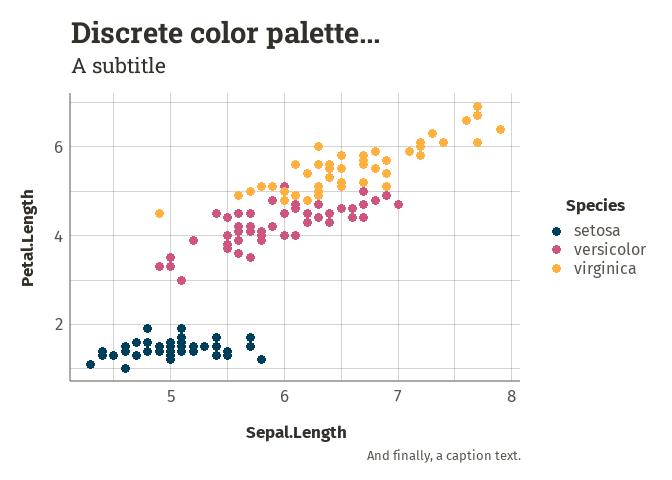

<!-- README.md is generated from README.Rmd. Please edit that file -->

# WaxTools

## Overview

`waxtools` is a package that brings together a set of useful day-to-day
functions to facilitate work in the field of (mainly) ecology. It offers
functions to clean up your datasets, customize your `ggplot2` graphs,
check and correct the geometry of sf objects, create nice commented
titles to separate scripts, and perform other specific tasks such as
calculating cumulative specific richness, reformatting dates into a
French format, etc. Thanks to the variety of its functions, `waxtools`
can be used efficiently and conveniently in a variety of contexts and
projects.

## Installation

``` r
devtools::install_github("waxtiz/waxtools")
```

``` r
library(waxtools)
```

## Usage

### Match taxons names

find_cd_name allows to use the INPN API to find by fuzzy search a list
of taxon names.

``` r
list_sci_species <- unique(naturalist_df$name)
list_sci_species
```

    ##  [1] "Sciurus vulgaris"    "Rupicapra rupicapra" "Capreolus capreolus"
    ##  [4] "Myocastor coypus"    "Sus scrofa"          "Vulpes vulpes"      
    ##  [7] "Meles meles"         "Felis silvestris"    "Castor fiber"       
    ## [10] "Mustela erminea"     "Cervus elaphus"

``` r
result <- waxtools::find_cd_nom(list_sci_species)
kableExtra::kable(result[1:4, 1:8])
```

<table>
<thead>
<tr>
<th style="text-align:left;">
sp
</th>
<th style="text-align:right;">
id
</th>
<th style="text-align:right;">
referenceId
</th>
<th style="text-align:right;">
parentId
</th>
<th style="text-align:left;">
scientificName
</th>
<th style="text-align:left;">
authority
</th>
<th style="text-align:left;">
fullName
</th>
<th style="text-align:left;">
fullNameHtml
</th>
</tr>
</thead>
<tbody>
<tr>
<td style="text-align:left;">
Sciurus vulgaris
</td>
<td style="text-align:right;">
61153
</td>
<td style="text-align:right;">
61153
</td>
<td style="text-align:right;">
197486
</td>
<td style="text-align:left;">
Sciurus vulgaris
</td>
<td style="text-align:left;">
Linnaeus, 1758
</td>
<td style="text-align:left;">
Sciurus vulgaris Linnaeus, 1758
</td>
<td style="text-align:left;">
\<i\>Sciurus vulgaris\</i\> Linnaeus, 1758
</td>
</tr>
<tr>
<td style="text-align:left;">
Rupicapra rupicapra
</td>
<td style="text-align:right;">
61119
</td>
<td style="text-align:right;">
61119
</td>
<td style="text-align:right;">
197289
</td>
<td style="text-align:left;">
Rupicapra rupicapra
</td>
<td style="text-align:left;">
(Linnaeus, 1758)
</td>
<td style="text-align:left;">
Rupicapra rupicapra (Linnaeus, 1758)
</td>
<td style="text-align:left;">
\<i\>Rupicapra rupicapra\</i\> (Linnaeus, 1758)
</td>
</tr>
<tr>
<td style="text-align:left;">
Capreolus capreolus
</td>
<td style="text-align:right;">
61057
</td>
<td style="text-align:right;">
61057
</td>
<td style="text-align:right;">
190320
</td>
<td style="text-align:left;">
Capreolus capreolus
</td>
<td style="text-align:left;">
(Linnaeus, 1758)
</td>
<td style="text-align:left;">
Capreolus capreolus (Linnaeus, 1758)
</td>
<td style="text-align:left;">
\<i\>Capreolus capreolus\</i\> (Linnaeus, 1758)
</td>
</tr>
<tr>
<td style="text-align:left;">
Myocastor coypus
</td>
<td style="text-align:right;">
61667
</td>
<td style="text-align:right;">
61667
</td>
<td style="text-align:right;">
194991
</td>
<td style="text-align:left;">
Myocastor coypus
</td>
<td style="text-align:left;">
(Molina, 1782)
</td>
<td style="text-align:left;">
Myocastor coypus (Molina, 1782)
</td>
<td style="text-align:left;">
\<i\>Myocastor coypus\</i\> (Molina, 1782)
</td>
</tr>
</tbody>
</table>

### waxtheme

``` r
library(ggplot2)
library(waxtools)

ggplot(iris, aes(Sepal.Length, Petal.Length, color = Species)) +
  geom_point() +
  labs(title = "First, a chart title",
       subtitle = "Below, a subtitle",
       caption = "And finally, a caption text.") +
  theme_wax(theme = "wax") +
  scale_color_wax_d()
```

<!-- -->

wax_theme uses by default the R fonts. However, it is possible to enter
the “wax” value in the theme parameter of the wax_theme function to use
other fonts. In this case, the fonts can be loaded like this:

``` r
sysfonts::font_add_google(name = "Fira Sans", family = "fira-sans")
sysfonts::font_add_google(name = "Roboto Slab", family = "roboto-slab")

showtext::showtext_auto()
```
